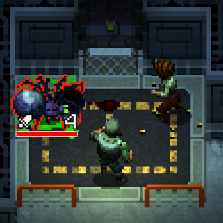

# Display Enemy Movement Speed - Continued Upgraded UI

## **Important!**
Make sure you are not subscribed to neither the original Display Enemy Movement Speed mod or the Continued version, or this mod will not work correctly.

# Functionality
For the people constantly right clicking on enemies to not get owned by 3AP melee goons. 
Shows the amount of action points an enemy can spend. If the enemy is melee only, an 'M' will also be displayed.

Toggleable with the comma key, rebindable with a config file.

# Continued Notes
This mod is a version of the Continued mod by [NBK_RedSpy](https://github.com/NBKRedSpy).
We are maintaining different versions of it for user preference.

At the same time, a continuation of GitHub user [jamsge's](https://github.com/jamsge) mod.

If needed, the mod will be taken down upon original author's request.

## Config
To rebind the comma key toggle, go to:
`%UserProfile%\AppData\LocalLow\Magnum Scriptum Ltd\Quasimorph_ModConfigs\QM_DisplayMovementSpeedUI\config.json`
and change "Comma" [with a Unity Keycode of your choice (scroll down to the Properties section)](https://docs.unity3d.com/ScriptReference/KeyCode.html).

## Source
Crynano's version: https://github.com/Crynano/QM-DisplayMovementSpeedContinuedUI
Continued version: https://github.com/NBKRedSpy/QM-DisplayMovementSpeedContinued

## Credits
Original source code used from [NBK_RedSpy](https://github.com/NBKRedSpy) and [jamsge's](https://github.com/jamsge).